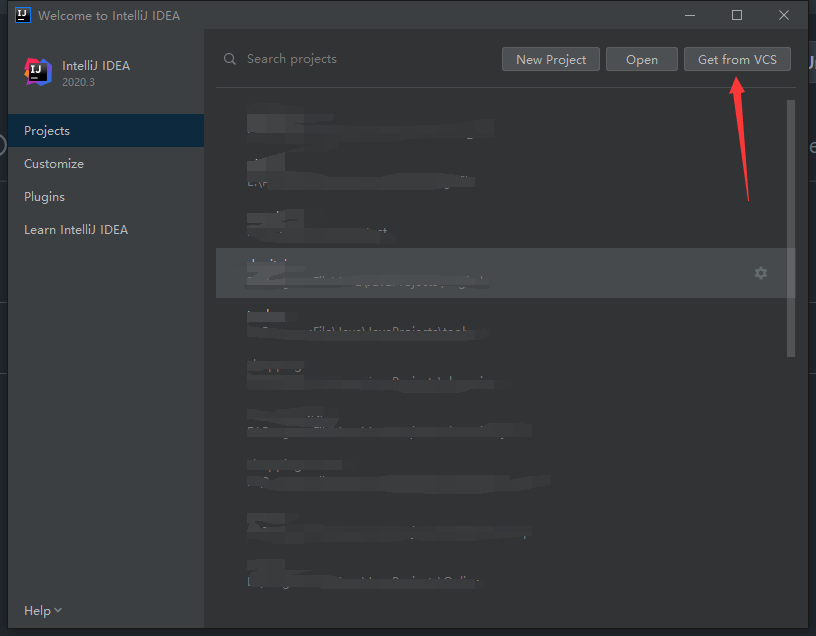
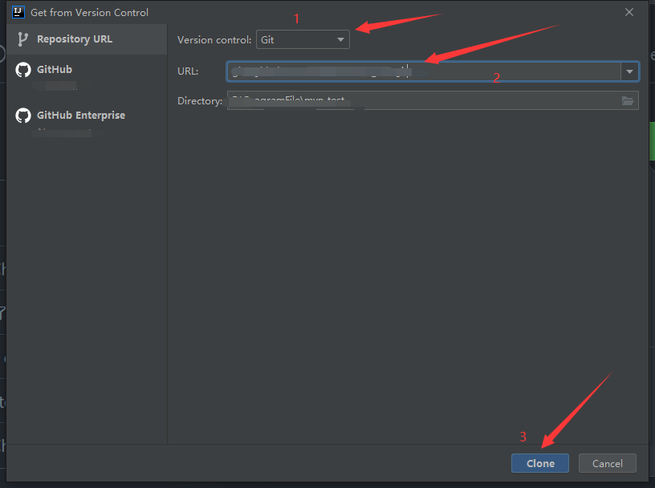
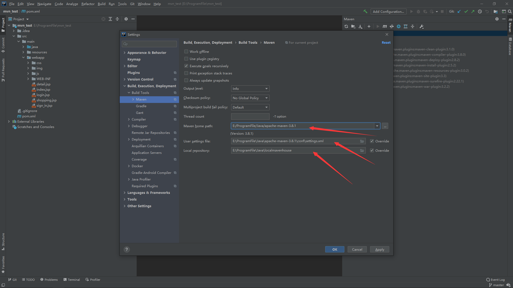
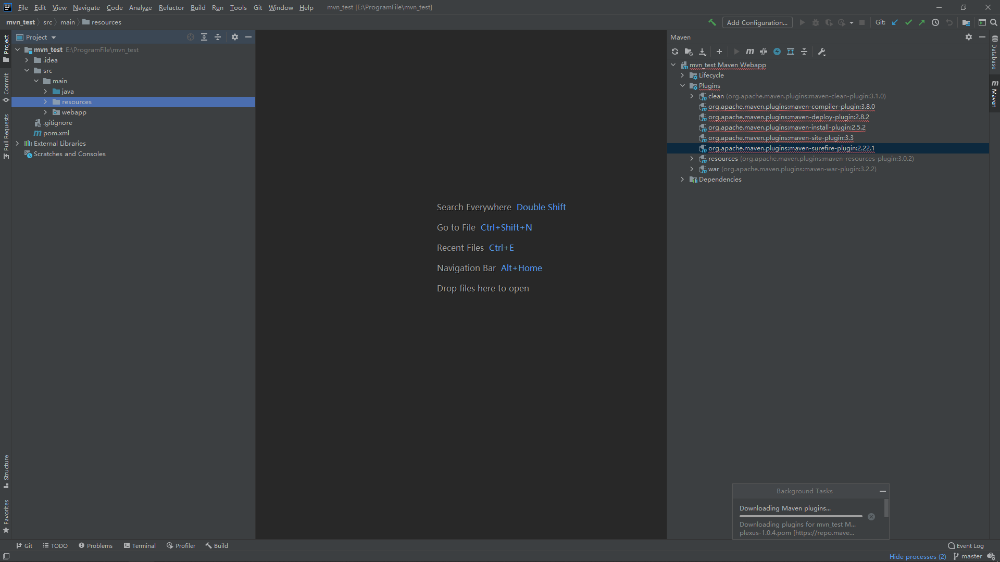
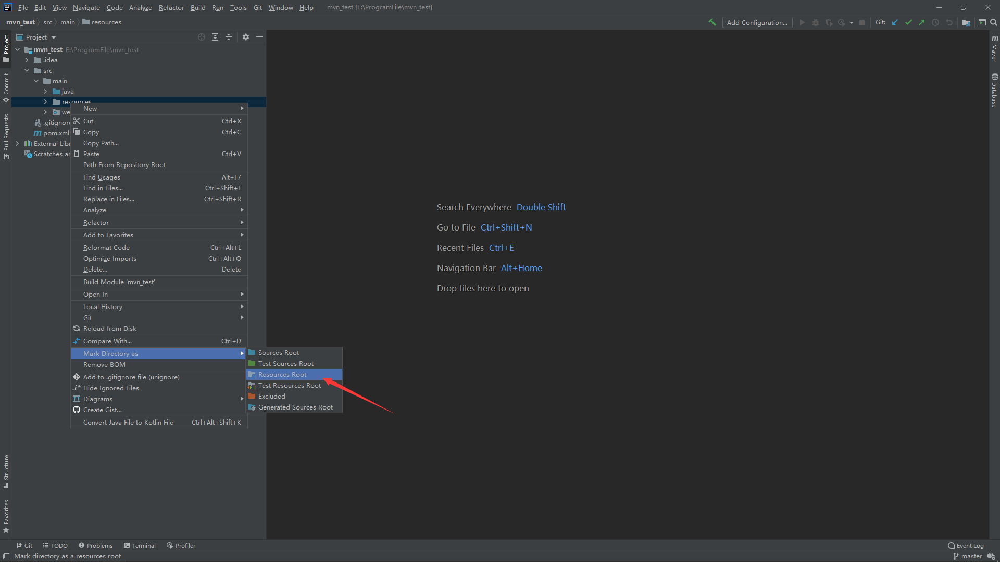
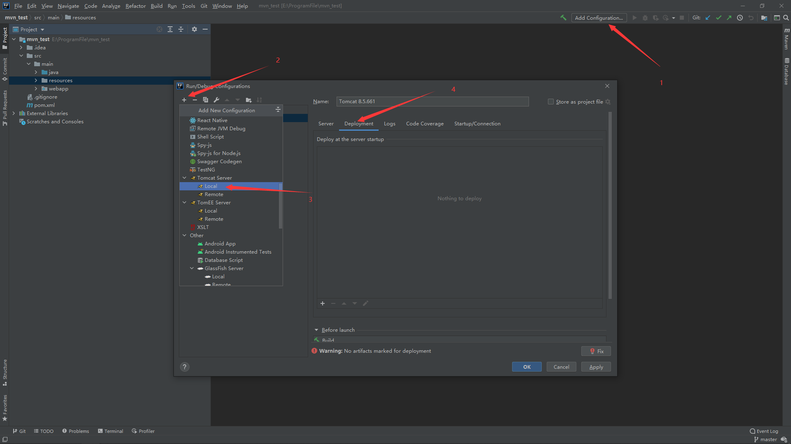
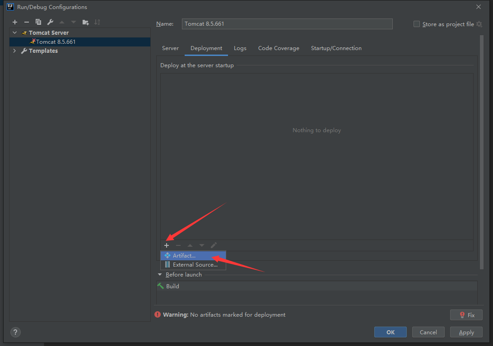
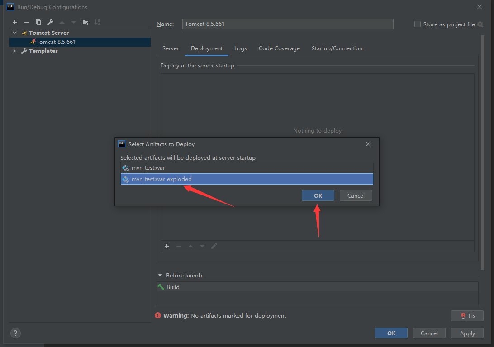

# idea项目配置
### 项目采用ssm架构
### 环境为: 
### jdk1.8
### tomcat8.5.661
### apache-maven-3.8.1
# 打开idea选择从VCS获取
 
# 输入项目ssh连接,选好保存的路径点击clone
 
# 配置maven以及仓库
 
# maven会自动下载项目依赖包,等待就好
 
# 将resources文件夹设置为资源文件夹,maven会从资源文件夹下找资源文件
 
# 配置tomcat
 
 
 

